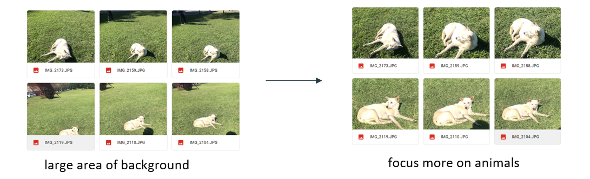
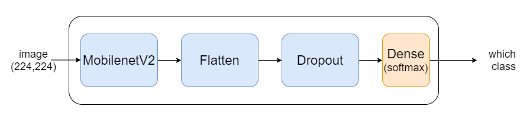
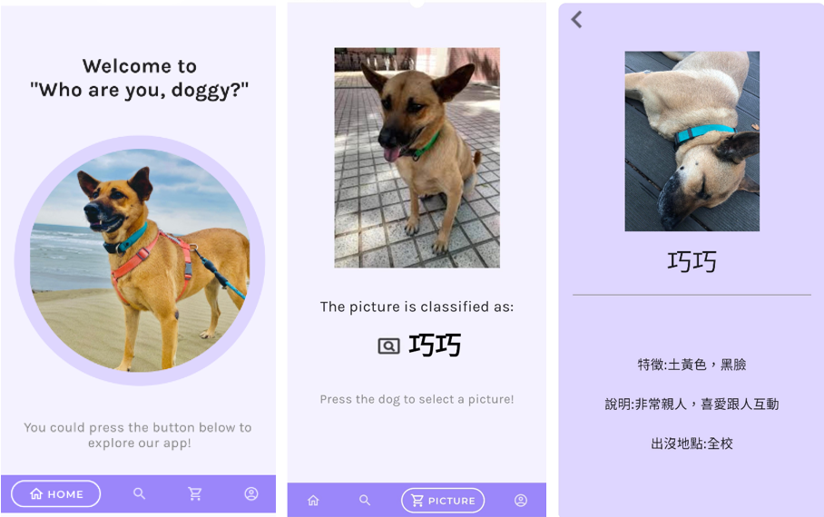

# WhoAreYouDoggy
## Introduction
NTHU animal classifier: an application to help user identify animals in NTHU

## Data collection
- Take photos by ourselves
- IG account
- FB club

11 classes, 1510 photos in total

## Data preprocess
Manually cutting out most of the background

## Training

- Base model: MobilenetV2
- Optimizer: Adam
- Loss: CategoricalCrossentropy
- Epoch: 50
- Batch size: 32

## Demonstration
